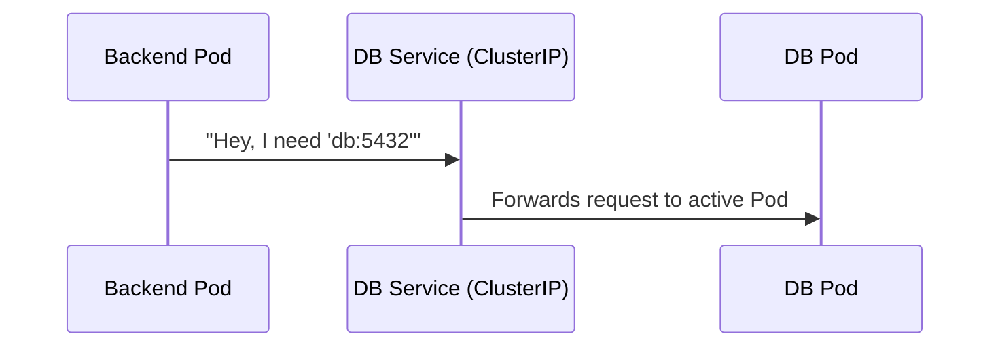

# 🚀 The K8s Deployment Journey: From Code to Cluster

Learning Kubernetes can feel like learning a hundred things at once. This guide breaks down the **deployment process** into four logical phases using this project as a live example.

---

## Phase 1: Dockerization (The Blueprint) 🐳
Before Kubernetes can run your app, it needs to be "packaged." 

1.  **The Code**: You have an Express app in the `express/` directory.
2.  **The Container**: A `Dockerfile` (often in the root or express dir) tells Docker how to build an image. 
3.  **The Registry**: Once built, the image is "pushed" to a registry like Docker Hub.
    *   *Our Example*: We are using the pre-built image `100xdevs/backend-pg:2`.

> [!NOTE]
> K8s doesn't run code; it runs **Images**. This ensures that the app runs the exact same way on your laptop as it does in the cloud.

---

## Phase 2: Orchestration (The Boss) 🎮
Now that we have images, we need K8s to run them. We use a **Deployment** for this.

### What does a Deployment do?
- **Self-Healing**: If a Pod dies, the Deployment starts a new one.
- **Scaling**: If you change `replicas: 2` to `replicas: 10`, K8s handles the heavy lifting of starting 8 new instances.
- **Rollouts**: If you update the image version, it gradually replaces old pods with new ones.

```yaml
# ops/backend/manifest.yml snippet
spec:
  replicas: 2  # <--- I want 2 copies always!
  template:
    spec:
      containers:
        - name: backend
          image: 100xdevs/backend-pg:2
```

---

## Phase 3: Internal Networking (The Switchboard) ☎️
Your Pods are running, but they have dynamic IP addresses. If a Pod restarts, its IP changes. How does the database find the backend? 

We use a **Service**.

### The Magic of `ClusterIP`
A Service creates a **Static Virtual IP** and a **DNS Name**.
- The backend app doesn't need to know the IP of the DB. it just connects to `db:5432`.
- K8s has an internal DNS server (CoreDNS) that translates `db` to the Service IP.
- The Service then load-balances the request to whatever DB Pod is alive.



---

## Phase 4: External Entry (The Front Door) 🏠
The world outside your cluster cannot see `ClusterIP` services. To let users in, we need a bridge.

### The "Manual Ingress" Logic
In this project, we built our own bridge using an NGINX Pod.

1.  **LoadBalancer Service**: Requests from the internet hit a Public IP (provided by your cloud/Minikube).
2.  **NGINX Pod**: This pod acts as the traffic controller.
3.  **ConfigMap**: We mount an `nginx.conf` file into the NGINX pod. This file is the "instruction manual" for where to send traffic.

```nginx
# From ops/reverse-proxy/manifest.yml
location / {
  proxy_pass http://backend.default.svc.cluster.local:3000;
}
```

---

## 🛠️ Practical Exercise: "The Chaos Test"
Want to see K8s in action? Try these commands:

1.  **Test Self-Healing**: 
    ```bash
    kubectl delete pod -l app=backend
    ```
    *Watch as K8s immediately starts a new pod because the Deployment says "I need 2 replicas!"*

2.  **Test Internal DNS**:
    ```bash
    kubectl exec -it <any-pod-name> -- nslookup backend
    ```
    *You'll see the internal IP address managed by the Service.*

3.  **Test Scaling**:
    ```bash
    kubectl scale deployment backend --replicas=5
    kubectl get pods
    ```

---

## 🏁 Summary
1.  **Image**: The package.
2.  **Deployment**: The manager (keeps it running).
3.  **Service**: The phonebook (helps pods find each other).
4.  **Ingress/Proxy**: The front gate (lets users in).
