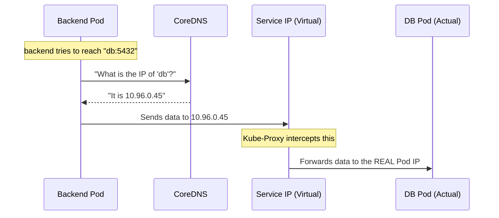

# 🌐 K8s Internal Networking: The 'ClusterIP' Mystery Solved

In a traditional setup, you'd give your database a Static IP like `192.168.1.50`. In Kubernetes, **Pods are mortal**—they die and get replaced constantly, and their IPs change every time. 

So how does the Backend reliably find the Database?

---

## 1. The Actor: The Pod
Every Pod gets its own IP address. However, you should **never** use this IP directly.
- **Problem**: If the DB Pod crashes and K8s restarts it, it gets a **new IP**. The Backend would lose connection.

## 2. The Identity: Labels & Selectors
Instead of IPs, we use **Labels**. 
- In `ops/db/manifest.yml`, we labeled our DB Pod with `app: db`.
- This label is the "Permanent Name Tag" for the database.

## 3. The Phonebook: The Service (ClusterIP)
We create a **Service** named `db`. 
- **The Selector**: The Service is told to watch for any Pod with the label `app: db`.
- **The Virtual IP**: The Service gets its own stable IP (the `ClusterIP`) that **never changes** as long as the Service exists.

## 4. The Translator: CoreDNS
Kubernetes runs a built-in DNS server called **CoreDNS**. 
- As soon as you create a service named `db`, CoreDNS creates a record:
  - `db` ➡️ `10.96.0.45` (The stable Service IP).
- This is why in your Backend code, you just connect to `postgres://db:5432`.

---

## 🚀 The Journey of a Packet (Step-by-Step)



---

## 🛠️ The Invisible Layer: Kube-Proxy
When the Backend sends a packet to the Service IP (`10.96.0.45`), that IP doesn't actually exist on any network card! 

It is a **Virtual IP**. A hidden agent called `kube-proxy` (running on every node) uses Linux networking rules (`iptables` or `ipvs`) to intercept that traffic and instantly redirects it to the real IP of a healthy DB Pod.

### Why is this great?
1.  **Zero Downtime**: If you have 3 DB replicas, the Service will automatically load-balance between them.
2.  **Simple Config**: Your backend code never needs to update its config. `db` is always `db`.
3.  **Security**: `ClusterIP` services are invisible to the outside world. Hacker's can't even "ping" your database from the internet.

---

> [!TIP]
> You can see this in action by running:
> ```bash
> kubectl get svc
> ```
> You will see the **CLUSTER-IP** column. This is the stable virtual IP that bridges the gap between your apps!

---

## ⚡ The Language of the Connection: Why TCP?

In all our manifests, you'll see `protocol: TCP`. 

### The Difference
- **TCP (Transmission Control Protocol)**: Like a phone call. You establish a connection, say "Hello," and ensure the other person heard every single word. If a word is missed, it's repeated.
- **UDP (User Datagram Protocol)**: Like shouting into a crowd. You send data and don't care if everyone hears it or if some parts are lost (used for streaming/gaming).

### Why we MUST use TCP here:
1. **Reliability**: Database queries and HTTP requests (Web traffic) cannot afford to lose even 1 bit of data. If you lose a packet in a SQL query, the whole operation fails.
2. **Order**: TCP ensures that data arrives in the exact same order it was sent. This is vital for correctly executing transactions or loading web pages.
3. **HTTP Requirement**: HTTP/1.1 and HTTP/2 (the foundation of the Web) are designed to run on top of TCP.
