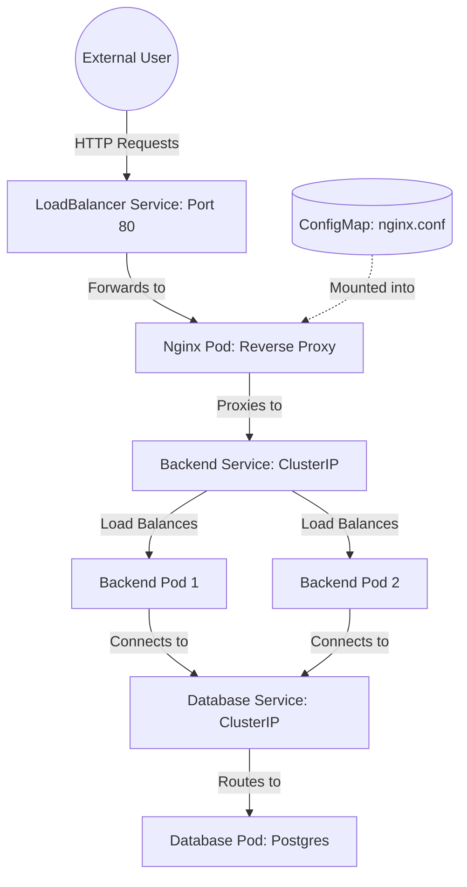

# ☸️ Kubernetes Manual Ingress: Learning Through Reverse Proxies

Welcome to the **Manual Ingress** project! This repository is designed to help you understand the fundamental networking concepts of Kubernetes by building a standard 3-tier application deployment from scratch, without the "magic" of automated Ingress controllers.

## 🏗️ The Architecture

Unlike a standard production environment that might use an Ingress Controller (like Nginx Ingress or Traefik), this project implements a **Manual Reverse Proxy**.



---

## 🧩 Component Breakdown

### 1. 📂 `ops/db/` (The Database)
- **Deployment**: Runs a single PostgreSQL instance.
- **Service**: A `ClusterIP` service on port `5432`.
- **Learning Point**: Databases are almost always `ClusterIP`. They should never be exposed to the public internet; they only need to be reachable by the backend.

### 2. 📂 `ops/backend/` (The Application)
- **Deployment**: Runs an Express.js app (`100xdevs/backend-pg:2`).
- **Replicas**: Set to `2`. This demonstrates how K8s handles high availability.
- **Service**: A `ClusterIP` service on port `3000`.
- **Learning Point**: Even if you have 10 replicas, the service provides **one** internal IP/DNS name (`backend`) that routes traffic to all of them.

### 3. 📂 `ops/reverse-proxy/` (The Manual Ingress)
This is where the magic happens. Instead of a K8s `Ingress` object, we use:
- **ConfigMap**: Contains the actual Nginx configuration. It tells Nginx to listen for `k8s-backend.100xdevs.com` and proxy it to `http://backend.default.svc.cluster.local:3000`.
- **Nginx Pod**: A standard Nginx container that mounts the ConfigMap.
- **Service (LoadBalancer)**: Exposes the Nginx pod to the internet.
- **Learning Point**: An "Ingress Controller" is essentially just a highly automated Nginx pod. By building it manually, you understand that an Ingress is just a reverse proxy mapping external URLs to internal services.

---

## 🚀 How to Deploy

Follow these steps to deploy the entire stack to your Kubernetes cluster:

### Step 1: Deploy the Database
```bash
kubectl apply -f ops/db/manifest.yml
```

### Step 2: Deploy the Backend
```bash
kubectl apply -f ops/backend/manifest.yml
```

### Step 3: Deploy the Manual Ingress
```bash
kubectl apply -f ops/reverse-proxy/manifest.yml
```

### Step 4: Verify the Deployment
Check if all pods are running:
```bash
kubectl get pods
```

Find the external IP of your ingress:
```bash
kubectl get svc ingress
```

---

## 🎓 Key K8s Concepts Learned
- **Pods vs Deployments**: Deployments manage the lifecycle and scaling of Pods.
- **Services**: Abstracting the networking so Pods can talk to each other by name.
- **ConfigMaps**: Injecting configuration files into containers without rebuilding images.
- **LoadBalancers**: The bridge between the cloud provider's network and your K8s cluster.
- **DNS Resolution**: How `backend.default.svc.cluster.local` allows the Nginx pod to find the backend app.

---

> [!TIP]
> To test the ingress locally without a real domain, you can add `127.0.0.1 k8s-backend.100xdevs.com` to your `/etc/hosts` (or `C:\Windows\System32\drivers\etc\hosts`) and use `minikube tunnel` if you are on Minikube.
